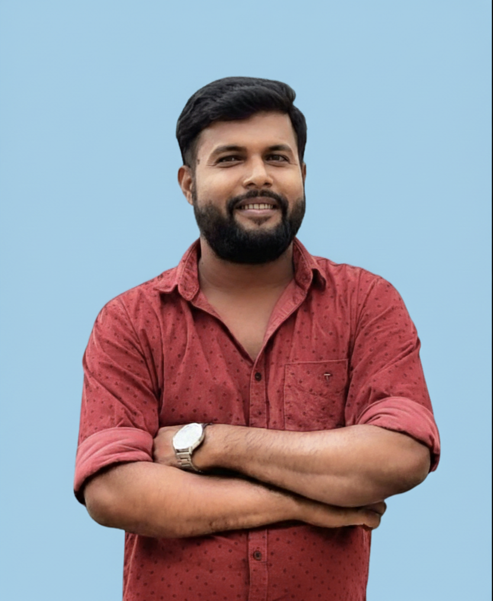

  <table>
    <tr>
      <td width="160" valign="top" align="center">
        

          
        

      </td>
      <td valign="middle">
        <h1 align="center">ROHAN DHANRAJ YADAV</h1>
        

          AI/ML Engineer | Generative AI | Agentic AI Systems
        

        

           <a href="mailto:rohan.dhanraj.y@gmail.com">rohan.dhanraj.y@gmail.com</a> | 
           <a href="https://wa.me/917008958143">+91-7008958143</a> | 
           Bengaluru, India 
           <a href="https://linkedin.com/in/rohan-dhanraj-yadav">LinkedIn</a> | 
           <a href="https://github.com/rohandhanraj">GitHub</a> | 
           <a href="https://rohandhanraj.github.io/">Portfolio</a>
        

      </td>
    </tr>
  </table>

---

## 🚀 SUMMARY

Results-driven AI/ML Engineer with **7+ years of total professional experience**, including **4+ years** building production-grade AI systems. Expert in **Generative AI, Agentic AI, LLMs, RAG,** and **Multi-Agent Orchestration**. Proven track record leading cross-functional teams of **15+ engineers**, architecting systems handling **4,500+ daily API requests**, processing **100K+ daily records**, and delivering **18–38% model performance improvements** for **Fortune 500 clients** (Cisco, ITC, KDP, Marco). Deep expertise in end-to-end ML pipelines, containerized deployment, and robust cloud API architecture.

---

## 🛠 TECHNICAL SKILLS

**Languages & Frameworks**: Python, FastAPI, Scikit Learn, Tensorflow, PyTorch, Transformers  
**AI & Agents**: LangChain, LangGraph, RAG, Multi-Agent Systems, Prompt Engineering  
**DevOps & Data**: Apache Airflow, Docker, AWS, GCP, SQL, NoSQL, Vector Databases (Qdrant, Milvus)

---

## 💼 EXPERIENCE

### AI/ML Engineer
**AI Tech Solutions Ltd. | Nov 2024 – Oct 2025**

* Designed and orchestrated multi-agent AI systems utilizing LangGraph for complex task execution
* Enhanced context retrieval relevance by 38% through hybrid RAG implementation
* Built high-throughput, asynchronous backend microservices using FastAPI

### Software Engineer
**Aimlytics Technology | Sep 2022 – Oct 2024**

* Architected scalable RAG-based assistants reliably processing 4,500+ daily API requests
* Fine-tuned BERT and RoBERTa models, improving text classification F1-scores by 18%
* Orchestrated ETL data pipelines via Airflow to handle 100K+ daily records for ML workflows

### Machine Learning Engineer Intern
**iNeuron.ai | Aug 2021 – Sep 2022**

* Accelerated hyperparameter tuning cycles by 35% using Optuna optimization
* Deployed containerized machine learning endpoints using Docker and Flask

---

## 🏗 PROJECTS

* **Omodore**: Autonomous Agentic AI platform demonstrating LangGraph state orchestration
* **GALAMBO**: Multi-modal AI assistant integrating vision models and real-time tool use
* **SalesMoji**: Scalable AI sales intelligence system leveraging vector search retrieval

---

## 🎓 EDUCATION

* **B.Tech Mechanical Engineering** | Biju Patnaik University of Technology
* **GATE Qualified** | Mechanical Engineering
* **Machine Learning Zoom Camp** | DataTalksClub
